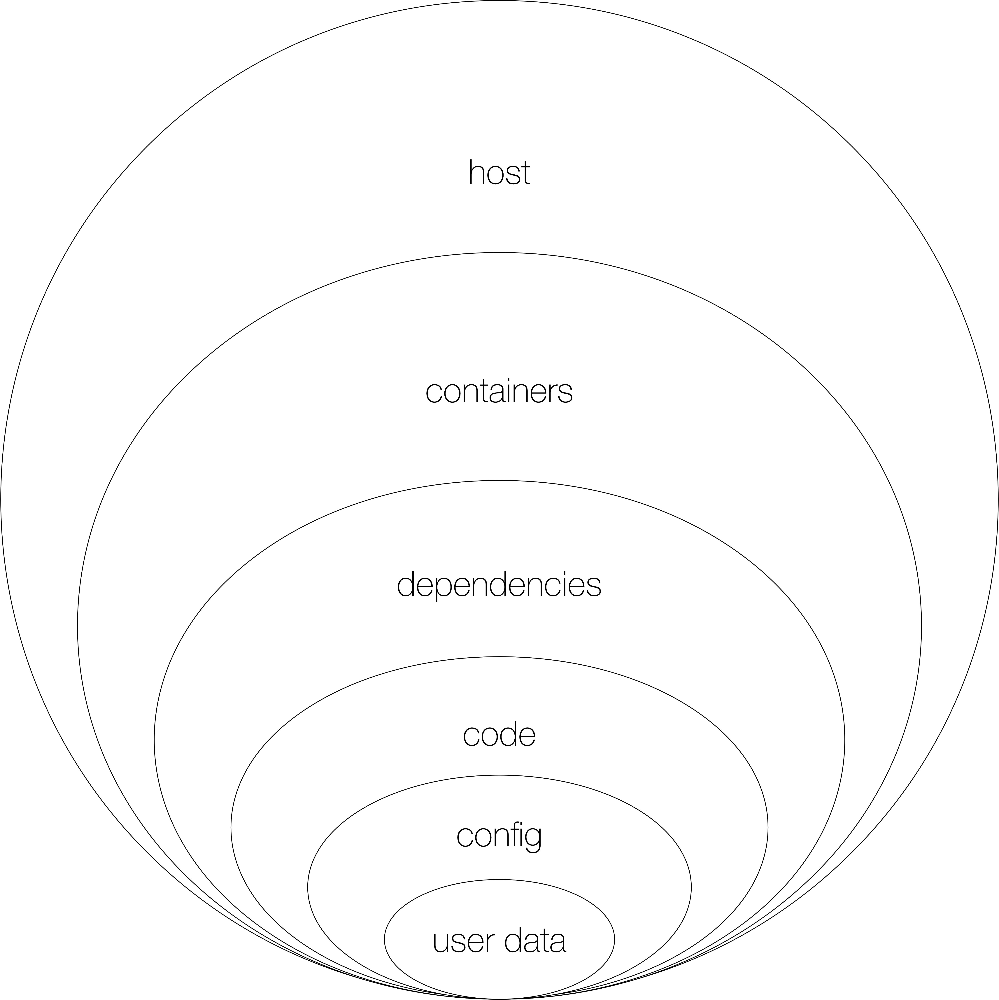

{id: ch_cn-sec-foundations}
#  Container Security Foundations

In this chapter we first have a look at the conceptual underpinning of container security. It's the defense in depth principle we apply throughout. We then review the foundational topics of identity, authentication, and authorization, as well as have a look how a secure supply chain can be used.

{id: foundations-did}
## Defense In Depth

The defense in depth (DID) onion diagram we're using throughout the book, looks as follows:



Some notes to the DID diagram:

1. User data
   a. The business core data itself
   b. Personal Identifiable Information (PII)
   c. Gotchas: leaks, GDPR (in Europe)
2. Configuration data 
   a. Sensitive configuration data (passwords, API keys), see the [Sensitive Data](#ch_secrets) chapter
   b. Gotchas: commits-to-source, non-separated access (for example, dev has clear-text passwords)
3. Source code
   a. Static code analysis 
   b. Runtime, for example, sanitizing user input
   c. Gotchas: log-leaking
4. Dependencies
   a. Source code and binary-level
   b. Code analysis
   c. Gotchas: big surface, many languages
5. Containers
   a. Runtimes and images, see the [Containers](#ch_containers) chapter
   b. Orchestration, see the [Container Orchestrators](#ch_co) chapter
   c. Containers share a kernel (mitigations: Firecracker, gVisor)
   d. Gotchas: unnecessary privileged users, no scans, trust
6. Host
   a. Compare full blown distro (Ubuntu, Amazon Linux) vs. minimal environment (container-optimized distributions)
   b. Multi-tenancy requirements
   c. Gotchas: Linux packages/CVEs,leaks, GDPR (in Europe)

There are several resources available that document and/or advice on good and bad practices, that is, things one should implement and what to avoid best, for example:

- UK's [Security architecture anti-patterns](https://www.ncsc.gov.uk/whitepaper/security-architecture-anti-patterns) 
- [The Kubernetes Security Process](https://kubernetes.io/blog/2017/05/kubernetes-security-process-explained/)
- [Security Goals - Automatic compliance reporting for Kubernetes](https://github.com/cds-snc/security-goals) of the Canadian Digital Service
- [The Three Faces of DevSecOps](https://www.infoq.com/presentations/devsecops-2019/)


{id: foundations-identity}
## Identity

[Identity management](https://en.wikipedia.org/wiki/Identity_management) revolves around *entities* such as people or an application and their respective digital representation. An entity can have multiple identities with different attributes attached, potentially context-dependent.

{aside}
### EXAMPLE: Identity

When you're visiting a website in your web browser, there are at least three entities involved:

- You, the human being.
- Your web browser.
- The website.

For example, when I look at `mhausenblas.info`, I'd encounter something like the following:


Inspecting the website's identity reveals that I'm using a self signed certificate, which is understandable given it's a GitHub page. 
{/aside}

In the context of containerized microservices, managing identities is such a central and necessary topic that an entire specification exists: the Secure Production Identity Framework for Everyone [SPIFFE](https://spiffe.io/).

Every cloud provider has identity solutions[^awsiam].

Kubernetes has, with its service account abstraction, a very explicit and clean way to [deal with identity](https://www.linuxjournal.com/content/kubernetes-identity-management-authentication).

[^awsiam]: See, for example, [An overview of IAM in AWS](https://medium.com/@sirech/an-overview-of-iam-in-aws-1d9cbb1b31a4) for an introduction to how it works in Amazon's case.


{id: foundations-authn}
## Authentication

In the context of this book, we define:

Authentication
: The process of confirming the identity claimed by an entity.

This means, based on a claim of an entity, there is a sequence of steps that either leads to confirming the claim, or not.

{aside}
### EXAMPLE: Authentication

For example, I can claim to be an Austrian living in Ireland. The authentication processes could be as follows:

1. Show me your passport, which confirms I have a valid Austrian citizenship.
1. Provide proof of residence, for example, through an utility bill to an Irish address, in my name. This proofs (to a certain extent) that I live in Ireland.

This example also shows to things: it's always a matter of trust (in certain artifacts such as the bill) as well as that while it's possible to verify a claim, the opposite is usually not possible. How do I proof to you that I am *not* living in, say, Austria? :)
{/aside}

{id: foundations-authz}
## Authorization

In the context of this book, we define:

Authorization
: The set of *privileges* assigned to an *entity* specifying access to a *resource*.

You can simplify that to: access control for authenticated entities.

{aside}
### EXAMPLE: Authorization

Look at this file here:

```sh
~/tmp
$ ls -al MINE
-rw-------  1 mhausenblas  mhausenblas  0 30 May 14:30 MINE
```

What's the authorization regime here? Well, I as the entity (or: user) `mhausenblas` have the privileges (or: rights) to both read and write the resource (or: file) `MINE`. Needless to say that declaring this with `chmod 600 MINE` is pretty useless, if there would not be a piece of software enforcing said authorization.
{/aside}


https://www.youtube.com/watch?v=TZ73EBP2a9Q

{id: foundations-supplychain}
## Supply Chain Security

[Grafeas](https://grafeas.io/)

[In-toto](https://in-toto.github.io/)

{id: tm-foundations}
## Threat Model

With any system a key element of it's security is determining the appropriate threat model(s), by reasoning about likely groups of attackers and the approaches they might take to attempting to compromise its security. Understanding the likely threat models allows organizations to prioritise work on the security controls they apply to their systems.  For example the threat model of a multi-tenant Kubernetes cluster which runs untrusted code, is very different to an individual Docker installation running only images produced within the organization.

With containerized systems there are a number of potential threat models to consider :-

- **External Attackers** - This is the most common threat model. It involves an attacker originating outside the containerized environment and attempting to gain unauthorised access to it.  Typical attack vectors for this threat model are listening services (e.g. Kubernetes API server or Docker daemon listening on a TCP port).

- **Compromised Container** - This threat model considers an attacker who has gained unauthorized access to a single container either via a vulnerability in the software running within the container, or via a compromise of a container image in its repository.  Here the goal of the attacker is generally to escalate their access, either to other containers within the system or to the control plane of the containerized environment.  In addition to vectors available to external attackers, in the compromised container scenario, the attacker has access to container filesystem and may be able to attack a shared Linux kernel.  

- **Compromised/Malicious User** - In a multi-user system such as Kubernetes it can be important to consider the risk of privilege escalation where a user's credentials have been compromised and the attacker is attempting to gain additional access to the system.  Addressing this threat model typically includes considering authorization controls that are in place within the environment, to reduce the risk of privilege escalation.

{id: gp-foundations}
## Good Practices
